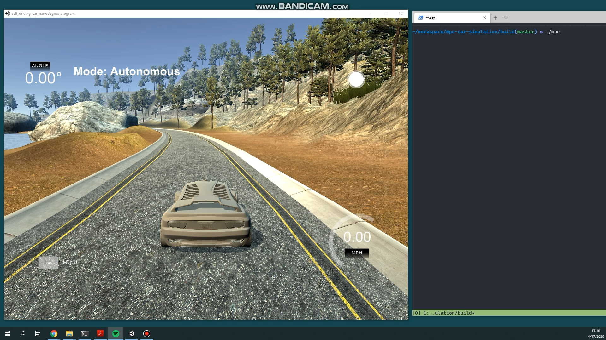

## MPC-Car-Simulation

This is a repository for a course project. The basic framework is from official implementation - Udacity. The compilation is referred to an other repository. I just finished the optimization code about the mpc controller. The visualization is an open-sourced simulator from Udacity too.

## Basic Build Instructions

1. Prepare the compilers `sudo apt install cmake gcc g++ gfortran cppad`
2. Clone this repo with the submodules recursively `git clone --recurse-submodules https://github.com/Wsine/mpc-car-simulation.git`
3. Execute `./install_ipopt.sh` and `./install_uwebsocket.sh` individually.
4. Make a build directory: `mkdir build && cd build`
5. Compile: `cmake .. && make`
6. Run it: `./mpc`.

Then, download the simulator from this [release](https://github.com/udacity/self-driving-car-sim/releases) page and try it.

The repository is tested under a pure ubuntu 18.04 environment.
